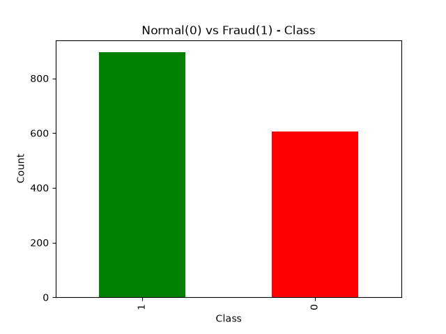
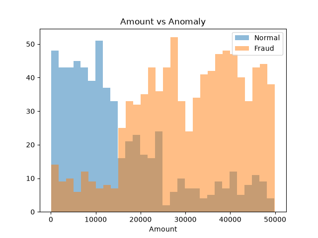

# Payment Transaction Anomaly Detection System

This project detects fraudulent and suspicious payment transactions using Machine Learning. It analyzes transaction amount, frequency and behavior patterns to identify anomalies in real-time and prevents financial fraud.

## 🎥 Project Demo
**Full Working Video:** https://drive.google.com/file/d/1uGOapVVf_dvQH5mgzAiqJQjpuh3JeGyJ/view?usp=drivesdk

## 🚀 Features
- Detects fraudulent payment transactions
- EDA (Exploratory Data Analysis) with graphs
- Machine Learning based anomaly classification
- Real-time detection

## 🛠️ Tech Stack
- Python
- Pandas, NumPy
- Scikit-learn
- Matplotlib / Seaborn

## 📊 Results

## ▶️ How to Run
pip install -r requirements.txt
python app.py

## 👩‍💻 Author
Lakshmi - B.Tech Final Year
Built for Internship Portfolio
